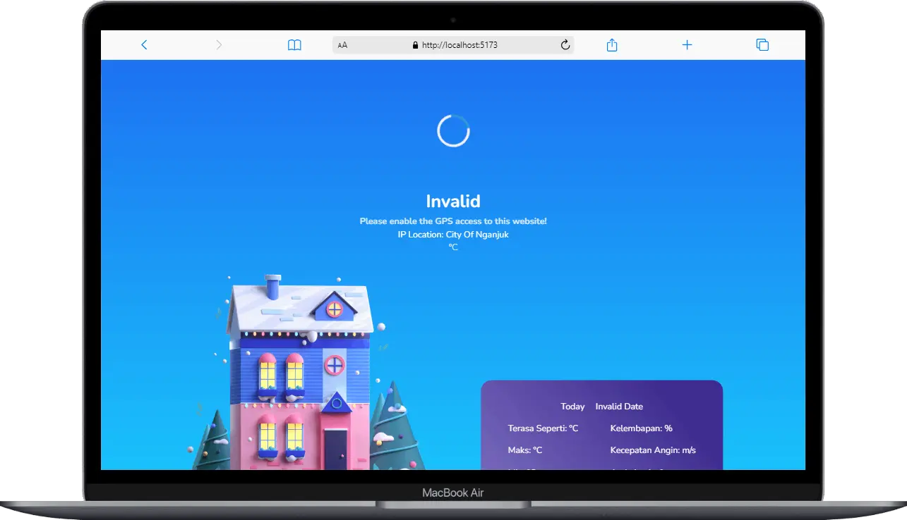
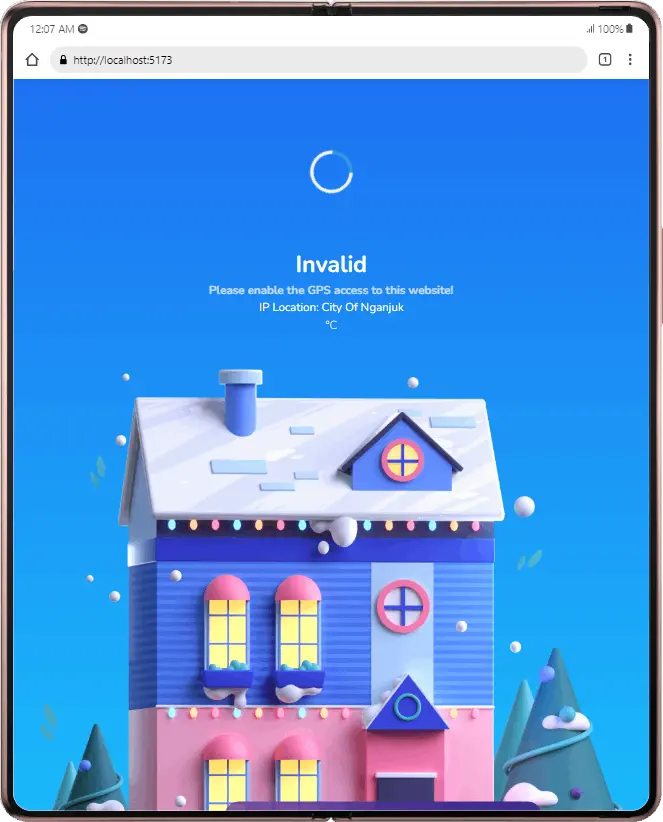
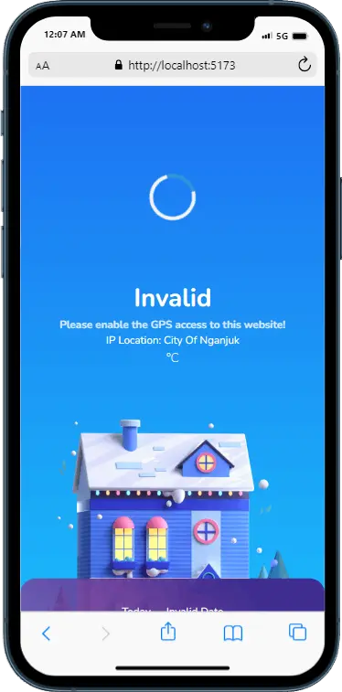

# Create weather app using react library and vite

Weather app is website that run seamless on device
This web was build using openWeather api and Ipinfo IP

# Features

- Showing the current city of your ip address
- Showing the current weather by your city
- I want to show the hourly forecast, but the api doesn't support because i using free plan

# Screenshot

# Demo

You can try out Weather App by visiting [Demo Link](https://weather-app-pink-six.vercel.app/).
